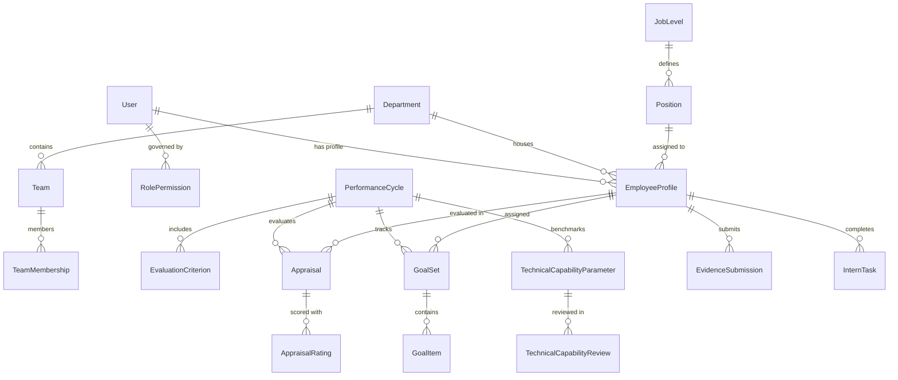

# PERFORMAX EPMS — System Technical Documentation

This document provides a comprehensive technical reference for the **PERFORMAX Enterprise Performance Management System (EPMS)**, covering the database schema, migration catalog, technology stack, automated test suites, and role-based access control (RBAC) architecture.

---

## 1. Database Schema

The system uses Django ORM mapped to relational database tables with foreign key constraints, unique indexes, JSON columns, and UUID primary keys across operational entities.



### 1.1 Core Authentication & Security (`apps.accounts`)
- **`accounts_user` (`User`)**:
  - `id` (BigAuto) — Primary Key
  - `username` (CharField, unique) — System username / employee handle
  - `email` (EmailField, unique) — Official work email
  - `role` (CharField) — Persona enum: `SUPER_ADMIN`, `HR`, `MANAGER`, `EMPLOYEE`, `INTERN`
  - `password_change_required` (BooleanField) — Enforces password reset on initial credential assignment
  - `is_active`, `is_staff`, `is_superuser` (BooleanField)
  - `date_joined`, `last_login` (DateTimeField)
- **`accounts_emailotp` (`EmailOTP`)**:
  - `id` (UUID), `email` (CharField), `otp_code` (CharField), `created_at`, `expires_at`, `is_used`
- **`accounts_passwordresettoken` (`PasswordResetToken`)**:
  - `id` (UUID), `user_id` (FK User), `token_hash` (CharField), `expires_at`, `is_used`
- **`accounts_rolepermission` (`RolePermission`)**:
  - `id` (UUID), `role` (CharField), `permission_code` (CharField), `description` (CharField) — Dynamic granular permission persistence

---

### 1.2 Organizational Hierarchy (`apps.organization`)
- **`organization_department` (`Department`)**:
  - `id` (UUID), `code` (CharField, unique), `name` (CharField), `description` (TextField), `is_active` (BooleanField)
- **`organization_joblevel` (`JobLevel`)**:
  - `id` (BigAuto), `level_code` (CharField, unique), `level_name` (CharField), `level_rank` (IntegerField)
- **`organization_position` (`Position`)**:
  - `id` (BigAuto), `position_code` (CharField, unique), `position_name` (CharField), `level_id` (FK JobLevel)
- **`organization_role` (`Role`)**:
  - `id` (BigAuto), `role_name` (CharField, unique), `description` (TextField)
- **`organization_team` (`Team`)**:
  - `id` (UUID), `name` (CharField), `department_id` (FK Department), `manager_id` (FK User), `description` (TextField)
- **`organization_teammembership` (`TeamMembership`)**:
  - `id` (UUID), `team_id` (FK Team), `employee_id` (FK EmployeeProfile), `is_lead` (BooleanField), `joined_at` (DateTimeField)
- **`organization_financialyear` (`FinancialYear`)**:
  - `id` (BigAuto), `title` (CharField), `start_date` (DateField), `end_date` (DateField), `is_current` (BooleanField), `status` (CharField)
- **`organization_performancecategory` (`PerformanceCategory`)**:
  - `id` (BigAuto), `name` (CharField), `min_score`, `max_score`, `rating_value` (IntegerField), `grade` (CharField)

---

### 1.3 Employee Information (`apps.employees`)
- **`employees_employeeprofile` (`EmployeeProfile`)**:
  - `id` (UUID) — Primary Key
  - `user_id` (OneToOneField User)
  - `employee_id` (CharField, unique) — Enterprise identifier (e.g. `EMP-1001`, `INT-2026-001`)
  - `department_id` (FK Department), `position_id` (FK Position), `manager_id` (FK User)
  - `joining_date` (DateField), `birth_place`, `competencies` (JSON/TextField), `phone_number`

---

### 1.4 Performance & Appraisals (`apps.performance`)
- **`performance_performancecycle` (`PerformanceCycle`)**:
  - `id` (UUID), `title` (CharField), `cycle_type` (CharField), `start_date`, `end_date` (DateField), `status` (`DRAFT`, `ACTIVE`, `IN_REVIEW`, `CALIBRATION`, `CLOSED`)
- **`performance_evaluationcriterion` (`EvaluationCriterion`)**:
  - `id` (UUID), `cycle_id` (FK PerformanceCycle), `name` (CharField), `maximum_score`, `weight` (DecimalField)
- **`performance_appraisal` (`Appraisal`)**:
  - `id` (UUID), `employee_id` (FK EmployeeProfile), `cycle_id` (FK PerformanceCycle), `reviewer_id` (FK User)
  - `appraisal_type` (CharField), `status` (`DRAFT`, `SELF_SUBMITTED`, `MANAGER_REVIEWED`, `CALIBRATED`, `PUBLISHED`)
  - `overall_score` (DecimalField), `classification` (CharField), `allow_intern_reply` (BooleanField)
- **`performance_appraisalrating` (`AppraisalRating`)**:
  - `id` (UUID), `appraisal_id` (FK Appraisal), `criterion_id` (FK EvaluationCriterion), `score` (DecimalField), `comments` (TextField)
- **`performance_technicalcapabilityparameter` (`TechnicalCapabilityParameter`)**:
  - `id` (UUID), `cycle_id` (FK PerformanceCycle), `name` (CharField), `category` (CharField), `benchmark_score`, `weight` (DecimalField), `created_by` (FK User)
- **`performance_technicalcapabilityreview` (`TechnicalCapabilityReview`)**:
  - `id` (UUID), `parameter_id` (FK TechnicalCapabilityParameter), `employee_id` (FK EmployeeProfile), `reviewer_id` (FK User), `score` (DecimalField), `mentor_assessment` (TextField), `status` (CharField)

---

### 1.5 Goals & KPI Library (`apps.goals`)
- **`goals_goal` & `goals_goalset`**:
  - Tracks individual and team goal commitments linked to active performance cycles.
- **`goals_kpilibrary` & `goals_kpilibrarydetail`**:
  - Centralized organizational KRA/KPI catalog categorized by department, role, target level, and unit metrics.
- **`goals_goalitem` & `goals_kpiprogressentry`**:
  - Granular KPI tracking with target values, progress percent, actuals, and log entries.
- **`goals_kpiaudittrail`**:
  - Immutable log recording goal modifications, calibration adjustments, change reasons, and actors.

---

### 1.6 Feedback, Evidence, Notifications & Intern Modules
- **`feedback_feedback` & `feedback_feedbackcomment`**: Continuous feedback streams, sentiment types (`PRAISE`, `IMPROVEMENT`, `CORRECTION`), and privacy levels (`PUBLIC`, `MANAGER_ONLY`, `PEER`).
- **`evidence_evidencesubmission`**: Intern & employee milestone proof submissions with URL attachments, file uploads, and reviewer status (`SUBMITTED`, `APPROVED`, `REVISION_REQUESTED`).
- **`intern_interntask`**: Intern tasks assigned by mentors with priority, due dates, review requirement, and progress status.
- **`intern_internform` & `intern_internformsubmission`**: Dynamic custom forms and survey questionnaires with multi-field JSON schema responses.
- **`audit_auditlog`**: Enterprise audit trail capturing `actor`, `action`, `entity_type`, `entity_id`, IP addresses, and JSON metadata.

---

## 2. Migrations Catalog

All Django database migrations are up to date and tracked:

| Application | Migration File | Key Changes & Operations |
| :--- | :--- | :--- |
| **`accounts`** | `0001_initial` | Custom `User` model with `UserRole` choices and permissions |
| | `0002_emailotp` | OTP security model for passwordless validation and reset |
| | `0003_user_password_change_required_and_more` | First-login password change enforcement flags |
| | `0004_rolepermission` | Dynamic `RolePermission` schema for database-persisted matrix |
| | `0005_seed_feedback_permissions` | Seeding initial feedback permission sets |
| **`organization`**| `0001_initial` | Department and core org entity schemas |
| | `0002_joblevel_role_department_code_position` | Job levels, ranks, positions, and departmental codes |
| | `0003_financialyear_performancecategory_...` | Financial cycles, evaluation criteria ranges, and role-level mapping |
| **`employees`** | `0001_initial` / `0002_initial` | Employee profile linked to User and Department |
| | `0003_alter_employeeprofile_joining_date` | Joining date constraints |
| | `0004_employeeprofile_competencies_and_more` | Skill competencies and bio attributes |
| | `0005_employeeprofile_birth_place_and_more` | Extended personal profile details |
| **`performance`**| `0001_initial` | Performance cycles and evaluation criteria |
| | `0002_appraisal_appraisalrating` | Appraisal workflow and individual criteria scoring tables |
| | `0003_performanceimprovementplan_...` | PIP and recognition rewards models |
| | `0004_alter_evaluationcriterion_options...` | Weighting and max score constraints |
| | `0005_appraisal_allow_intern_reply...` | Added intern reply workflows to appraisal reviews |
| | `0006_technicalcapabilityparameter...` | Tech Manager technical capabilities parameter and review tables |
| **`goals`** | `0001_initial` | Basic goal and progress update tables |
| | `0002_kpicategory_goalset_kpiaudittrail...` | Complete KRA Library, GoalSet versioning, and KPI progress tracking |
| **`feedback`** | `0001_initial` | Feedback and feedback comments models |
| | `0002_feedback_is_anonymous_...` | Anonymous feedback mode and multi-level visibility |
| **`evidence`** | `0001_initial` / `0002_initial` | Milestone evidence upload, status tracking, and mentor verification |
| **`intern`** | `0001_initial` | Intern tasks, goal comments, self-appraisals, and dynamic forms |
| | `0002_interntask_requires_mentor_review...` | Mentor verification flags and submission workflows |
| **`notifications`**| `0001_initial` / `0002_...` / `0003_...` | Scheduled notification broadcaster, delivery timers, and type enums |
| **`attendance`** | `0001_initial` | Daily attendance log with check-in/out timestamps |
| **`training`** | `0001_initial` | Training courses catalog and employee course enrollments |
| **`audit`** | `0001_initial` | Immutable audit log model |

---

## 3. Technology Stack

```
┌────────────────────────────────────────────────────────┐
│                   FRONTEND (CLIENT)                    │
│  React 19 • TypeScript 6 • Vite 8 • Tailwind CSS 4    │
│  Redux Toolkit (RTK Query) • React Router 7 • Recharts │
└───────────────────────────┬────────────────────────────┘
                            │ REST JSON / JWT (Bearer)
┌───────────────────────────▼────────────────────────────┐
│                   BACKEND (API)                        │
│  Python 3.11 • Django 5 • Django REST Framework 3.15   │
│  SimpleJWT • drf-spectacular (OpenAPI 3) • Gunicorn   │
└───────────────────────────┬────────────────────────────┘
                            │ Django ORM / SQL Engine
┌───────────────────────────▼────────────────────────────┐
│                   DATABASE & DEPLOY                    │
│  PostgreSQL (Production) / SQLite (Dev)               │
│  Render (Backend) • Vercel (Frontend SPA Routing)      │
└────────────────────────────────────────────────────────┘
```

### 3.1 Frontend Architecture
- **Core Framework**: React `19.2.5` with TypeScript `~6.0.2`
- **Build Tooling**: Vite `8.0.9` with `@vitejs/plugin-react` `6.0.1`
- **Styling**: Tailwind CSS `v4.2.3` using `@theme` color tokens, royal purple palette, and glassmorphic filters
- **State Management & Caching**: Redux Toolkit `^2.11.2` (`@reduxjs/toolkit`) + RTK Query for automated endpoint caching and cache invalidation tags
- **Routing**: React Router DOM `^7.14.1` with role-guarded protected routes (`ProtectedRoute.tsx`)
- **Data Visualization**: Recharts `^3.8.1` for pulse histograms, radar charts, and trend metrics
- **UI Components & Icons**: Lucide React `^1.14.0`, React Toastify `^11.1.0`, React Signature Canvas `^1.0.7`

### 3.2 Backend Architecture
- **Language & Runtime**: Python `3.11`
- **Framework**: Django `5.x` with Django REST Framework `3.15.0`
- **Authentication**: `djangorestframework-simplejwt` `5.3.0` (Access & Refresh tokens with rotating JWTs)
- **API Documentation**: `drf-spectacular` `0.27.0` (OpenAPI 3 schema, Swagger UI at `/api/docs/`)
- **CORS Handling**: `django-cors-headers` `4.3.0`
- **Static Assets & Production Server**: WhiteNoise middleware, Gunicorn WSGI server

### 3.3 Infrastructure & Cloud Configuration
- **Platform as a Service**: Render (`render.yaml`) for backend web service (`gunicorn config.wsgi:application`)
- **Frontend Hosting**: Vercel (`vercel.json`) with SPA rewrite rules (`/(.*)` -> `/index.html`)
- **Continuous Integration**: Postman collections, Django test runner

---

## 4. Automated Test Suites & Verification

The backend includes comprehensive test suites across all core domain apps. All **25 automated tests pass with 0 errors**:

```bash
Ran 25 tests in 16.305s — OK
```

| Module | Test Class | Test Name | Purpose & Verification | Status |
| :--- | :--- | :--- | :--- | :--- |
| **`accounts`** | `UserModelTests` | `test_create_intern_user` | Verifies user creation with role `INTERN` and hashing | **PASSED** |
| | | `test_create_superuser` | Verifies superuser creation with admin permissions | **PASSED** |
| | | `test_duplicate_email_rejected` | Enforces email uniqueness constraint | **PASSED** |
| | | `test_roles_enumeration` | Verifies all `UserRole` choice values | **PASSED** |
| **`attendance`** | `SupportingModulesTests`| `test_attendance_unique_constraint` | Prevents duplicate daily attendance per employee | **PASSED** |
| | | `test_training_course_and_enrollment` | Tests course creation and employee progress | **PASSED** |
| | | `test_feedback_privacy_isolation` | Verifies feedback visibility restrictions | **PASSED** |
| | | `test_recognition_reward_creation` | Validates peer recognition award creation | **PASSED** |
| | | `test_audit_service_logging` | Asserts tamper-evident audit log creation | **PASSED** |
| **`employees`** | `EmployeeAndOrganizationAPITests` | `test_jwt_login_and_me_endpoint` | Validates JWT token generation and `/me` endpoint | **PASSED** |
| | | `test_intern_least_privilege_scoping` | Ensures interns cannot access unauthorized data | **PASSED** |
| | | `test_manager_scoping` | Tests manager access to direct report records | **PASSED** |
| | | `test_hr_can_create_employee_atomically` | Validates atomic creation of User + EmployeeProfile | **PASSED** |
| | | `test_intern_cannot_create_employee` | Blocks 403 Forbidden for intern employee creation | **PASSED** |
| **`goals`** | `GoalsAndEvidenceAPITests` | `test_manager_can_create_goal_with_kpi` | Validates goal creation with associated KPI target | **PASSED** |
| | | `test_intern_progress_logging_...` | Tests intern progress update calculation | **PASSED** |
| | | `test_evidence_submission_and_review` | Tests milestone proof submission and mentor review | **PASSED** |
| **`performance`** | `PerformanceScoringAndAppraisalTests` | `test_scoring_mathematical_precision` | Validates weighted scoring engine algorithms | **PASSED** |
| | | `test_appraisal_lifecycle_and_visibility`| Enforces stage gates from draft to publish | **PASSED** |
| **`reports`** | `ReportsAPITests` | `test_intern_can_view_own_summary` | Verifies employee personal dashboard data | **PASSED** |
| | | `test_intern_forbidden_other_report` | Blocks access to other employees' reports | **PASSED** |
| | | `test_manager_can_view_team_summary` | Verifies manager aggregated team metrics | **PASSED** |
| | | `test_intern_cannot_access_team_report` | Blocks non-manager from team performance metrics | **PASSED** |
| | | `test_hr_can_view_organization_summary`| Verifies company-wide report access for HR | **PASSED** |
| | | `test_export_performance_csv` | Tests CSV export generation and MIME headers | **PASSED** |

---

## 5. Role-Based Access Control (RBAC) Table

The access control model implements **Principle of Least Privilege (PoLP)** enforced at both backend (DRF permission classes) and frontend (React route guards and sidebar conditional rendering).

| Permission Area | Code | Super Admin | HR Partner | Tech Manager | Intern / Employee |
| :--- | :--- | :---: | :---: | :---: | :---: |
| **Master Control** | `ALL` | ✅ Full Override | ❌ | ❌ | ❌ |
| **Role Management** | `ROLE_MANAGE` | ✅ Edit / Assign | ❌ | ❌ | ❌ |
| **Permission Matrix** | `PERMISSION_MANAGE`| ✅ Configure | ❌ | ❌ | ❌ |
| **System Audit Logs** | `SYSTEM_AUDIT` | ✅ View / Export | ❌ | ❌ | ❌ |
| **Employee Directory** | `USER_MANAGE` | ✅ Full CRUD | ✅ Create / Edit | 👁️ Team Read | 👁️ Self Read |
| **Org Structure** | `ORG_GOVERNANCE` | ✅ Full CRUD | ✅ Departments/Teams | 👁️ Read-only | 👁️ Read-only |
| **Performance Cycles** | `CYCLE_MANAGE` | ✅ Create / Launch | ✅ Manage / Close | 👁️ Read-only | 👁️ Active only |
| **Evaluation Rubrics** | `CRITERIA_MANAGE` | ✅ Global Config | ✅ Form Builder | 👁️ Read-only | ❌ |
| **Appraisal Publish** | `APPRAISAL_PUBLISH`| ✅ Overrides | ✅ Final Release | ❌ | ❌ |
| **Manager Evaluation** | `APPRAISAL_EVALUATE`| ✅ Supervise | ✅ Calibrate | ✅ Score Reports | ❌ |
| **Self-Appraisal** | `APPRAISAL_SELF` | ❌ | ❌ | ✅ Self | ✅ Self |
| **KRA / KPI Library** | `KPI_LIBRARY_MANAGE`| ✅ Full Control | ✅ Manage Catalog | 👁️ Assign Team | 👁️ View Own |
| **Goal Assignment** | `GOAL_ASSIGN` | ✅ System-wide | ✅ Org-wide | ✅ Team Directs | ❌ |
| **Goal Progress** | `GOAL_LOG` | ✅ All | ✅ All | ✅ Team Reviews | ✅ Log Own |
| **Tech Capabilities** | `TECH_CAPABILITY` | ✅ Manage Library | ✅ View Overview | ✅ Review & Score | 👁️ View Assigned |
| **Evidence Submission**| `EVIDENCE_SUBMIT` | ❌ | ❌ | ❌ | ✅ Submit Proof |
| **Evidence Review** | `EVIDENCE_REVIEW` | ✅ Oversee | 👁️ View | ✅ Approve/Reject | ❌ |
| **Continuous Feedback**| `FEEDBACK_GIVE` | ✅ Give / View All | ✅ Give / View All | ✅ Give / Team | ✅ Give Peer / Self |
| **Executive Analytics**| `REPORT_VIEW_ALL` | ✅ Strategic Pulse | ✅ Org Dashboards | 👁️ Team Pulse | 👁️ Personal Only |
| **Intern Tasks** | `TASK_MANAGE` | ✅ View All | 👁️ View All | ✅ Create / Assign | ✅ Complete Tasks |
| **Announcement Hub** | `NOTIFICATION_POST`| ✅ Broadcast Org | ❌ | ❌ | 👁️ Read Inbox |

### 5.1 Lockout Protection & Security Safeguards
- **Immunity Against Demotion**: The system prevents demoting the last active Super Admin to avoid accidental lockout.
- **Dynamic Permission Service**: `apps/accounts/services/role_permission_service.py` provides synchronization between in-memory default permissions and the `RolePermission` database table.
- **Scoped Querysets**: DRF API views automatically scope querysets:
  - Interns can only query objects where `employee_id == request.user.profile.id`.
  - Managers can only query objects where `employee__manager_id == request.user.id` or assigned team members.
  - HR and Super Admin have organization-wide visibility.
